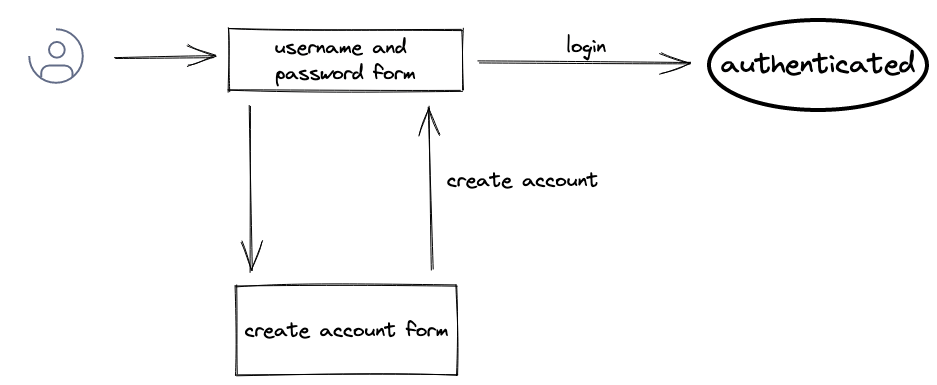
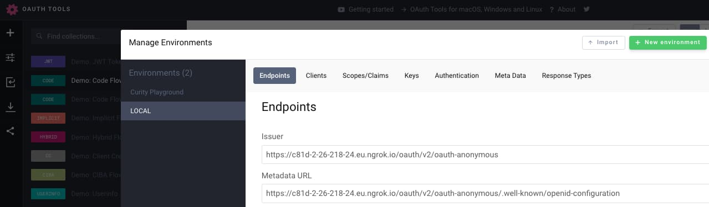
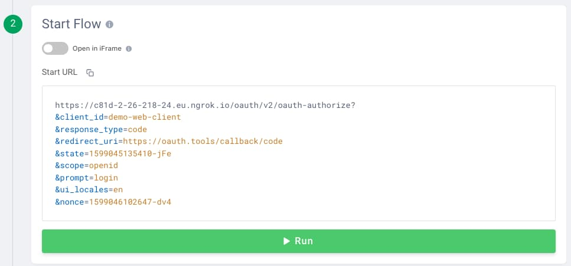
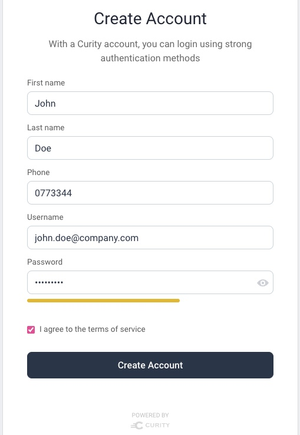

# Default Identity Behavior

This describes how the main account is created when username and password authentication is used.\
It also shows how access tokens convey this identity to APIs.

## Requirements

The following flow chart describes the desired behaviour of this flow.



## Configure OAuth Tools

Configure OAuth Tools to point to your instance of the Curity Identity Server.\
Provide a URL of the following form to create an environment:

```text
https://c81d-2-26-218-24.eu.ngrok.io/oauth/v2/oauth-anonymous/.well-known/openid-configuration
```



Run a code flow with these details:

- Client ID: demo-web-client
- Client Secret: Password1
- Scope: openid



## Register and Login

Create an account when prompted, to save your user to the database:



Then perform your initial password login:


## Database Behavior

A PostgreSQL database is deployed with the Curity Identity Server, to store user accounts.\
This data is reset on every deployment, so that you must re-register users.\
This enables the initial account linking and subsequent logins to be run many times.

## Query Identity Data

Connect to the SQL docker container included with the deployment:

```bash
CONTAINER_ID=$(docker ps | grep postgres | awk '{print $1}')
docker exec -it $CONTAINER_ID bash
```

Then connect to the SQL database:

```bash
export PGPASSWORD=Password1 && psql -p 5432 -d idsvr -U postgres
```

Then run these queries to view the initial data:

```bash
select * from accounts;
select * from linked_accounts;
```

As would be expected, this contains a single account line, with no linked accounts yet:

| account_id | username | phone | attributes |
| ---------- | -------- | ----- | ---------- |
| 7a0b9310-4ae3-11ed-9054-0242ac120003 | john.doe@company.com | 0773344 | given_name: John, family_name: Doe |

## View Access Tokens

Upon return to OAuth Tools, redeem the code for tokens and introspect the access token.\
This shows the JWT that will be presented to your APIs by default:


The initial access token, once introspected, will contain fields such as these.\
The access token uses a [Pairwise Pseudonymous Identifier (PPID)](https://curity.io/resources/learn/ppid/) for the subject claim.\
This ID is a stable yet private identity that will be presented to your APIs:

```json
{
  "jti": "fb1b2e48-7860-4302-8f42-0f77397158ed",
  "delegationId": "1ce1b16e-03f2-4985-8750-6dc6817e02f6",
  "exp": 1665661040,
  "nbf": 1665660740,
  "scope": "openid",
  "iss": "https://c81d-2-26-218-24.eu.ngrok.io/oauth/v2/oauth-anonymous",
  "sub": "35996a48baa64ac46614349b134e867276f199db5b392e42900142134a723e51",
  "aud": "demo-web-client",
  "iat": 1665660740,
  "purpose": "access_token"
}
```
