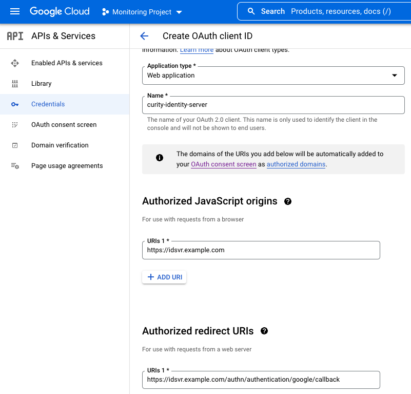
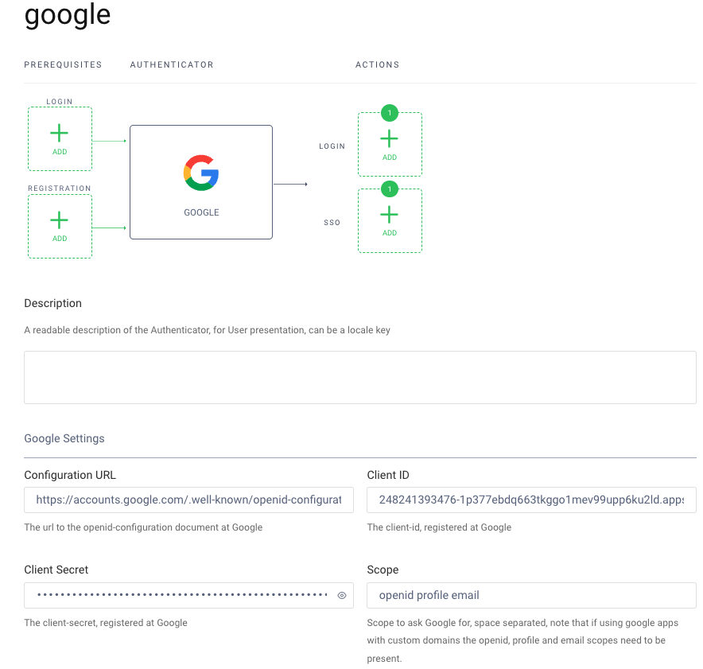
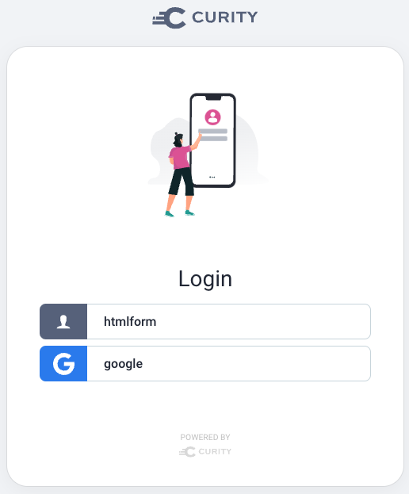
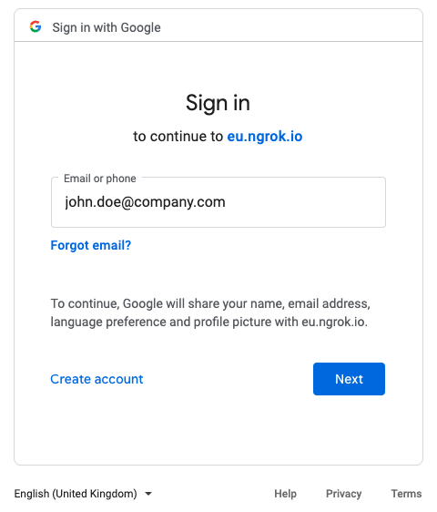

# Extra Login Identity Behavior

This describes how to introduce an extra form of login that may suit some users better.\
This example adds Google logins in addition to the default usernames and passwords.

## Configure Google Identity

First use the Google Developer Console to create an OAuth Client ID.\
Configure this to point to your instance of the Curity Identity Server, and note the `Client ID` and `Client Secret` values.



Supply the above Google values as environment variable in the deployment.\
In the Admin UI, the Google Authenticator will then be configured with account linking actions:



## Perform an Initial Google Login

First an authentication selection screen is presented, and each user can select the option that works best for them:



Select Google and enter credentials when prompted:



The first time the user signs in via Google they are then prompted to provide an existing password based identity.\
Completely new users will create a new account to register themselves:


## Query Account Data

After running this flow you can query the account data, as described in the [Default Behavior](./1-default-behavior.md) page.\
You will see that it still contains a single account record and there has been no duplication of identities:

| account_id | username | attributes |
| ---------- | -------- | ----- |
| 0cee591a-461b-11ed-8779-0242c0a89002 | john.doe@company.com | given_name: John, family_name: Doe |

There is now a linked_accounts record.\
The combination of `linked_account_domain_name` and `linked_account_id` is globally unique:

| account_id | linked_account_id | linked_account_domain_name | linking_account_manager |
| ---------- | ----------------- | -------------------------- | ----------------------- |
| a19b0254-4952-11ed-aac5-0242ac1a0003 | 102269322839797161925 | google-domain | default-account-manager |

## Perform a Subsequent Google Login

On the next login the user is no longer prompted with the HTML Form authenticator.\
They provide only Google credentials, and the user is identified from the `linked_accounts` table.

## Access Tokens

The updated access token, once introspected, is exactly the same as previously.\
The update to the new login method therefore has no impact on your APIs:

```json
{
  "jti": "678605ec-5979-4dea-ac32-673fe5e65b2b",
  "delegationId": "c02167cd-2cdd-4a1b-b806-3c7476568c6e",
  "exp": 1665134652,
  "nbf": 1665134352,
  "scope": "openid",
  "iss": "https://idsvr.example.com/oauth/v2/oauth-anonymous",
  "sub": "642a797c311f0b7aef3db4e0a292bc69b924e6496d1e87aa3b28672c01611da7",
  "aud": "demo-client",
  "iat": 1665134352,
  "purpose": "access_token"
}
```

## Controlling Logins from Applications

An application can bypass the authentication selection screen if required.\
To do so, send this OpenID Connect parameter from OAuth Tools or your application:

```text
acr_values=urn:se:curity:authentication:google:google
```

## Further Details

A number of authentication actions are used in this type of flow.\
The actions are described in detail for a different social provider, in the [Account Linking with Facebook](https://curity.io/resources/learn/account-linking-with-facebook/) tutorial.