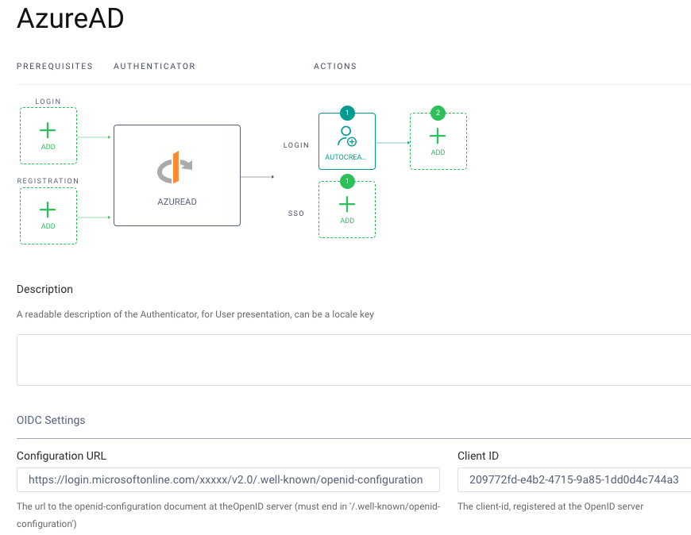
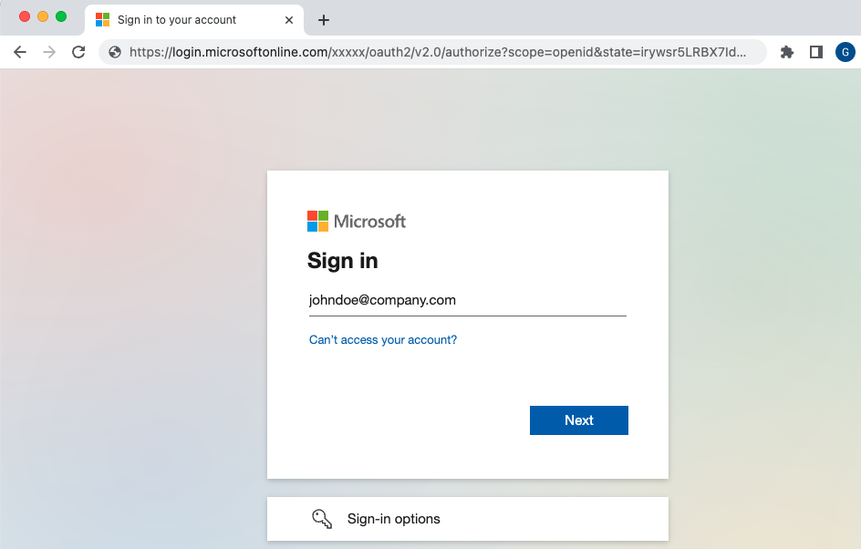

# External Accounts Identity Behavior

This describes how to use an external account as your main account, and bypass use of usernames and passwords.\
This example uses a federated login to Azure Active Directory as the main account.

## Configure Azure Active Directory

Login to the Azure Portal and create an OAuth client that redirects to your Curity Identity Server:

```text
https://idsvr.example.com/authn/authentication/AzureAD/callback
```

Note the generated Client ID and also create a Client Secret.\
See the [Azure AD Setup Tutorial](https://curity.io/resources/learn/oicd-authenticator-azure/) for further details.

## Create an OpenID Connect Authenticator

In the Curity Identity Server, create an OIDC authenticator and enter the corresponding details.\
These will include the Azure AD metadata endpoint, which will be a value of this form:

```text
https://login.microsoftonline.com/mytenantid/v2.0/.well-known/openid-configuration
```



This authenticator will be responsible for creating the main account record.\
It therefore uses an `Auto Create Account` option and is assigned a `local account` domain.

## Perform an Azure AD Login

Use OAuth Tools to run a code flow and you will now perform a federated login.\
The Curity Identity Server uses the Authorization Server role and Azure AD acts as an Identity Provider:



## Query Account Data

After login you can query account

If you query data you will see that there is a single account record and no linked accounts.\
The data shape is the same as the default password behavior.\
The username saved is the subject claim from the Azure AD system.

| account_id | username | email |
| ---------- | -------- | ----- |
| 0cee591a-461b-11ed-8779-0242c0a89002 | FyOVI8ZfGEBca1kUsQ1HoYbnOLkJtkepGxnsMtYDZic | john.doe@company.com |

## Future Account Linking

You can then add further login methods in future, that can be linked to the main account.\
This will work in an equivalent way to that described in [Extra Login Behavior](./2-extra-login-behavior.md).

## Access Tokens

Access tokens also have the same data shape as previously and continue to use a PPID.\
APIs will receive the same `sub` claim regardless of the authentication method used:

```json
{
  "jti": "78aefc27-bb45-455b-8cc8-16f4b825f0a9",
  "delegationId": "ec57e21d-b0e9-4dee-a253-bafb8f3f1b63",
  "exp": 1665661983,
  "nbf": 1665661683,
  "scope": "openid",
  "iss": "https://c81d-2-26-218-24.eu.ngrok.io/oauth/v2/oauth-anonymous",
  "sub": "35996a48baa64ac46614349b134e867276f199db5b392e42900142134a723e51",
  "aud": "demo-web-client",
  "iat": 1665661683,
  "purpose": "access_token"
}
```
