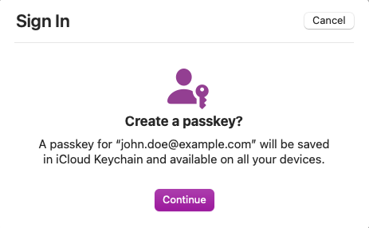
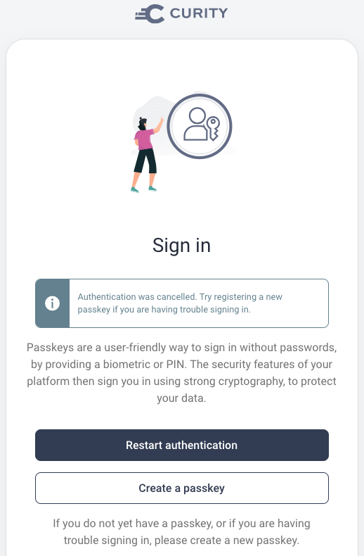

# Migrating to Passkeys Behavior

This page shows how you can introduce logins with passkeys in an opt-in manner.\
This enables existing users to upgrade from passwords to passkeys, with the same user identity.

## Requirements

The following flow chart describes the desired behaviour of this flow.


Detailed information on migrating to passkeys is available in the following resources on the Curity website:

- [What are Passkeys?](https://curity.io/resources/learn/what-are-passkeys/)
- [Passkeys - Design your Solution](https://curity.io/resources/learn/passkeys-design-your-solution/)
- [Migrating to Passkeys](https://curity.io/resources/learn/migrating-to-passwordless/)

## Code Example Overview

In this scenario, internet users can choose to log in with a password or can upgrade to a passkey.\
The scenario reliably handles a number of different user types:

| User Type | Description |
| --------- | ----------- |
| Existing Users (Passwords) | Users who continue to sign in with passwords after passkeys are enabled |
| Existing Users (Passkeys) | Users who upgrade from passwords to passkeys when they are are enabled |
| New Users (Passwords) | Future users who sign up and choose to use password logins |
| New Users (Passkeys) | Future users who sign up and choose to use passkey logins |

### Authentication Selection

On every login a username authenticator is shown and the user provides their email.\
This is only typed on the initial login and is then autofilled from a cookie:


A script action then runs to determine whether the user exists and has a passkey registered.\
If the user does not have passkeys they can choose how to sign in via a selector action.\
Users who don't want to use passkeys can continue to use passwords:


### Existing User Flow

When an existing user first chooses to sign in with a passkey, the user performs the passkey registration ceremony:


Before registering a passkey the user must authenticate:


In the example deployment this is done by simply clicking an email link.\
Browse to `http://localhost:1080` to do so using the maildev tool.


Next, the browser uses operating system APIs to create a passkey.\
To register, the user simply clicks continue and then uses their device authentication method, e.g. a fingerprint or PIN.



On all future logins the username authenticator is displayed and the authentication selector screen is bypassed.\
The user again provides their device authentication method, e.g. a fingerprint or PIN, to prove they are present.

### New User Flow

New users also onboard by first entering their email in the username authenticator.\
When an account is not found, the user is presented with the authentication selection screen.\
The user must then create an account after which they can create a passkey or password.

### Roaming and Recovery

Passkeys can be synchronized across multiple browsers and devices, though there are some technology limitations.\
The current technology support is explained in the [Passkeys - Design your Solution](https://curity.io/resources/learn/passkeys-design-your-solution/) article.\
You can enable a solution where the user can recover from any roaming or lost passkey scenario:

- Passkey cannot be synchronized to a particular browser or device
- User clears one or more passkeys from their browser
- User gets a new computer or mobile device

To do so, the user simply performs the registration ceremony again.



### Account Data

After running this flow you can query the account data, as described in the [Default Behavior](./1-default-behavior.md) page.\
The PostgreSQL data will contain a single account record for each user:

| account_id | username | phone | attributes |
| ---------- | -------- | ----- | ---------- |
| 65c4928a-4bab-11ed-bd06-0242ac120002 | john.doe@company.com | 0773344 | given_name: John, family_name: Doe |

Passkeys are stored in a `devices` table, and a simplified form of the data is shown below:

| account_id | device_id | type | publicKey |
| ---------- | --------- | ---- | --------- |
| 65c4928a-4bab-11ed-bd06-0242ac120002 | 6f2761a2-6931-413d-8caa-00e4b4f015d3 | webauthn | pQECAyYgASF ... |

### Access Tokens

For all users, access tokens issued to applications will contain the same values for the subject claim as previously.\
So migrating to passkeys will have no impact on your OAuth-secured APIs:

```json
{
  "jti": "adf9f0fc-3d38-402e-af52-187506190886",
  "delegationId": "cd231bba-ffa7-4c0e-ab5c-69b350fab979",
  "exp": 1665744658,
  "nbf": 1665744358,
  "scope": "openid",
  "iss": "https://14ff-2-26-218-28.eu.ngrok.io/oauth/v2/oauth-anonymous",
  "sub": "55ace8f2473cc2848c17d460326122db46dda6cff80d6754d10a0ff5ac13b940",
  "aud": "demo-web-client",
  "iat": 1665744358,
  "purpose": "access_token"
}
```
