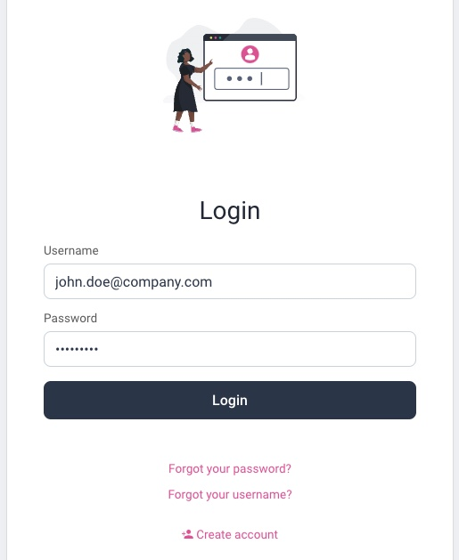

# Migrating to Passkeys Behavior

This page describes shows how logins with passkeys can be introduced in an opt-in manner.\
This enables existing users to upgrade from passwords to passkeys, with the same user identity.

## Requirements

The following flow chart describes the desired behaviour of this flow.


## Example Scenario

There are many security solutions that could be designed with passkeys.\
In this scenario, internet users can either login with a password, or can upgrade to a passkey.

## Authentication Selection

On every login a username authenticator is shown and the user provides their email.\
This will only be typed on the initial login and then will be autofilled from a cookie:


A script action then runs to determine whether the user has a passkey registered.\
If not then the user may choose how to sign in via a selector action.\
Users who don't want to use passkeys can continue to use passwords:


## Existing Users

When an existing user chooses to first login with a passkey, the user is prompted to register a passkey:


To do so, the user must first authenticate via their current method:



Next, the browser uses operating system APIs to create a passkey.
The user then sees the following screen and is considered authenticated when the proceed button is clicked:


On all future logins the username authenticator is displayed first, with the autofilled username.\
If the user has a passkey registered, the selector screen is bypassed.\
The user is simply prompted to use their device authentication method to sign in, e.g. a fingerprint or PIN.

## Future Users

New users, whose email does not exist, can continue to onboard, with either passkeys or passwords.\
Those who selected the password option will use the standard registration form and set a password:


Those who selected the passkeys option will instead use a custom registration form:


## Account Data

After running this flow you can query the account data, as described in the [Default Behavior](./1-default-behavior.md) page.\
The PostgreSQL data will contain a single account record for each user:

| account_id | username | phone | attributes |
| ---------- | -------- | ----- | ---------- |
| 65c4928a-4bab-11ed-bd06-0242ac120002 | john.doe@company.com | 0773344 | given_name: John, family_name: Doe |

Passkeys are stored in a `devices` table, and a simplified form of the data is shown below:

| account_id | device_id | type | publicKey |
| ---------- | --------- | ---- | --------- |
| 65c4928a-4bab-11ed-bd06-0242ac120002 | 6f2761a2-6931-413d-8caa-00e4b4f015d3 | webauthn | pQECAyYgASF ... |

## Account Recovery

When required, multiple passkeys can be registered by a user, and they are all linked to the same identity.\
This enables the user to recover if they ever lose their existing passkey.\
It also enables them to roam across devices when passkey synchronization is not supported.

## Access Tokens

Access tokens issued to applications will contain the same details and subject claim as previously.\
So migrating to passkeys will have no impact on your OAuth-secured APIs:

```json
{
  "jti": "adf9f0fc-3d38-402e-af52-187506190886",
  "delegationId": "cd231bba-ffa7-4c0e-ab5c-69b350fab979",
  "exp": 1665744658,
  "nbf": 1665744358,
  "scope": "openid",
  "iss": "https://14ff-2-26-218-28.eu.ngrok.io/oauth/v2/oauth-anonymous",
  "sub": "55ace8f2473cc2848c17d460326122db46dda6cff80d6754d10a0ff5ac13b940",
  "aud": "demo-web-client",
  "iat": 1665744358,
  "purpose": "access_token"
}
```
