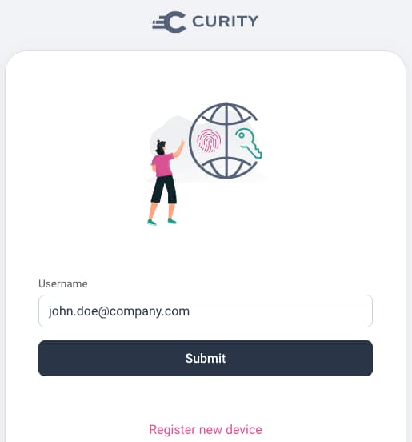
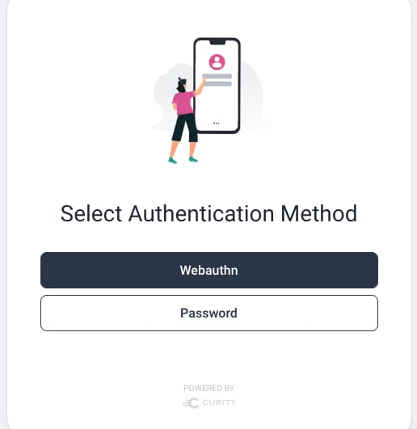
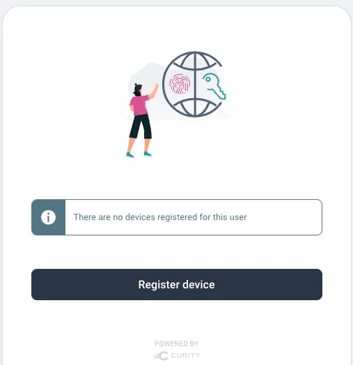
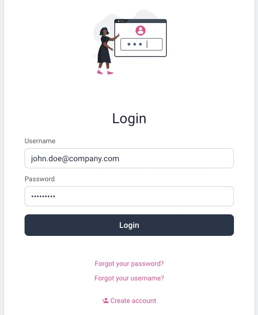
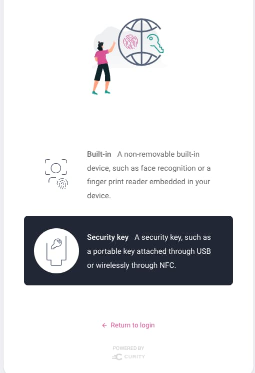
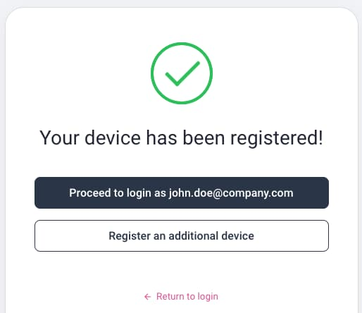
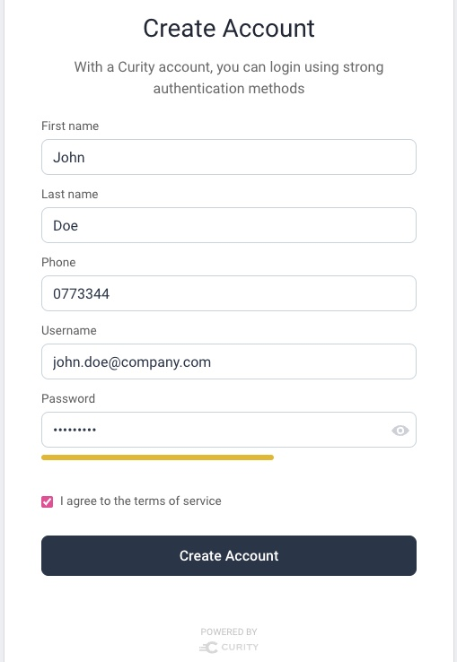
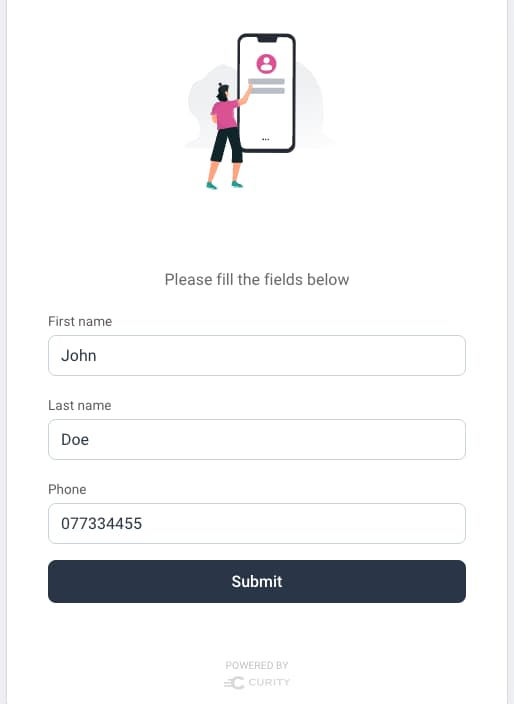

# Migrating to Passwordless Identity Behavior

This page describes shows how passwordless logins can be introduced gradually, in an opt-in manner.\
This is done by identifying the user, then setting the primary authentication factor dynamically.

## Example Scenario

There are many security solutions that could be designed with WebAuthn.\
In this scenario, internet users can either login with a password, or can bring their own WebAuthn platform device.\
Once the WebAuthn device is registered they no longer use password based logins.

## Authentication Selection

On every login a username authenticator is shown and the user provides their email.\
This will only be typed on the initial login and then will be autofilled from a cookie:



A script action then runs to determine whether the user has a WebAuthn key registered.\
If not then the user may choose how to sign in via a selector action.\
Users who don't want to use WebAuthn can continue to use the password option:



## Gradual User Migration to WebAuthn

When an existing user selects WebAuthn, the user is prompted to register a device:



To onboard to WebAuthn, the user must first authenticate via their current method:



Next the user selects the security key option, inserts a YubiKey into a USB port and taps it:



The user then sees the following screen and is considered authenticated when the proceed button is clicked:



On all future logins the username authenticator is used first, with the autofilled username.\
If the user has WebAuthn keys registered, the selector screen is bypassed.\
The user is then prompted to insert the YubiKey, and simply taps it to sign in.

## Future Users

New users, whose email does not exist, can continue to onboard and use either passwords or WebAuthn.\
Those who selected the password option will use the standard registration form and set a password:



Those who selected the Webauthn option will instead use a passwordless registration form:



## Account Data

After running this flow you can query the account data, as described in the [Default Behavior](./1-default-behavior.md) page.\
The PostgreSQL data will contain a single account record for each user:

| account_id | username | phone | attributes |
| ---------- | -------- | ----- | ---------- |
| 65c4928a-4bab-11ed-bd06-0242ac120002 | john.doe@company.com | 0773344 | given_name: John, family_name: Doe |

WebAuthn keys are stored in a `devices` table, and a simplified form of the data is shown below.\
Multiple WebAuthn keys can be registered, and they are all linked to the same identity.

| account_id | device_id | type | publicKey |
| ---------- | --------- | ---- | --------- |
| 65c4928a-4bab-11ed-bd06-0242ac120002 | 6f2761a2-6931-413d-8caa-00e4b4f015d3 | webauthn | pQECAyYgASF ... |

## Access Tokens

Access tokens issued to applications will contain the same details and subject claim as previously.\
So migrating to WebAuthn will have no impact on your APIs:

```json
{
  "jti": "adf9f0fc-3d38-402e-af52-187506190886",
  "delegationId": "cd231bba-ffa7-4c0e-ab5c-69b350fab979",
  "exp": 1665744658,
  "nbf": 1665744358,
  "scope": "openid",
  "iss": "https://14ff-2-26-218-28.eu.ngrok.io/oauth/v2/oauth-anonymous",
  "sub": "55ace8f2473cc2848c17d460326122db46dda6cff80d6754d10a0ff5ac13b940",
  "aud": "demo-web-client",
  "iat": 1665744358,
  "purpose": "access_token"
}
```
