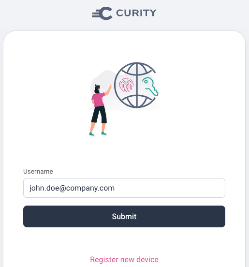
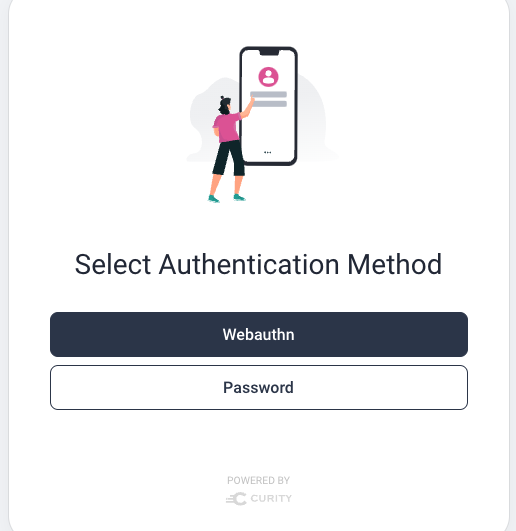
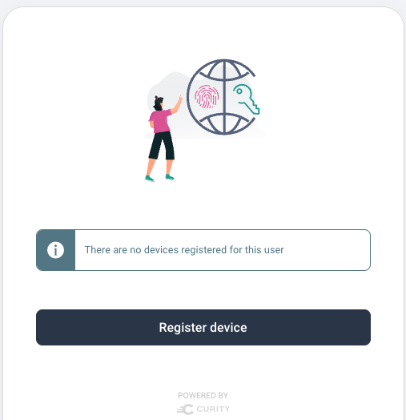
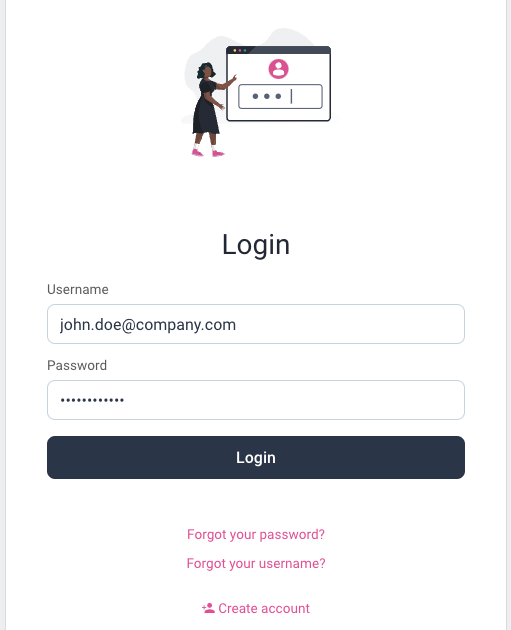
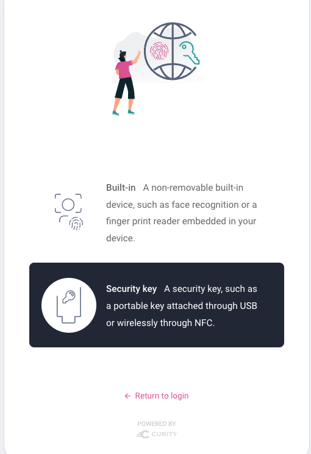
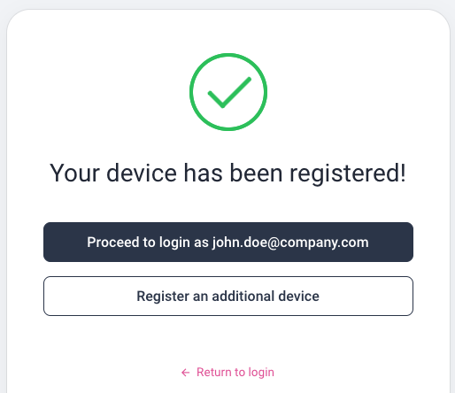

# Migrating to Passwordless Identity Behavior

This page describes shows to dynamically change the primary authentication factor.\
By default users login with passwords, but can opt into use of Webauthn keys.\
This enables a phased migration to improve both security and usability.

## Example Scenario

There are many security solutions that can be designed with Webauthn.\
In this scenario, internet users can either login with a password, or can bring their own Webauthn platform device.\
Once the Webauthn device is registered they no longer use password based logins.

## Authentication Selection

On every login a username authenticator is shown and the user provides their email.\
This will only be typed on the initial login and then will be autofilled from a cookie:



A script action then runs to determine whether the user has a WebAuthn key registered.\
If not then the user may choose how to sign in via a selector action.\
Users who don't want to use Webauthn can continue to use an HTML form:



## Webauthn Onboarding

When the Webauthn option is selected, the user is prompted to register a device:



Users cannot register with only a Webauthn key, since applications need details such as a user name.\
So after email identification the user is prompted to create an account and authenticate with an initial password:



Next the user selects the security key option, inserts a YubiKey into a USB port and taps it:



The user then sees the following screen and can complete their login:



## Subequent Logins

On subsequent logins the user simply submits the username authenticator with the autofilled username.\
When prompted, the user against inserts the YubiKey and taps it.\
Webauthn logins use cryptographic keys and are more secure than passwords, and also more user friendly.

## Account Data

The account record contains a single account record:

| account_id | username | email |
| ---------- | -------- | ----- |
| 65c4928a-4bab-11ed-bd06-0242ac120002 | john.doe@company.com | john.doe@company.com |

Rather than linked accounts, Webauthn keys are stored as devices, and a simplified form of the data looks like this.\
Multiple Webauthn keys could be provided, and there would be no account duplication.

| account_id | device_id | type | publicKey |
| ---------- | --------- | ---- | --------- |
| 65c4928a-4bab-11ed-bd06-0242ac120002 | 6f2761a2-6931-413d-8caa-00e4b4f015d3 | cross-platform | pQECAyYgASF ... |

## Access Tokens

Access tokens issued to applications will contain the same details and subject claim as previously.\
So migrating to Webauthn will have no impact on your APIs:

```json
{
  "jti": "adf9f0fc-3d38-402e-af52-187506190886",
  "delegationId": "cd231bba-ffa7-4c0e-ab5c-69b350fab979",
  "exp": 1665744658,
  "nbf": 1665744358,
  "scope": "openid",
  "iss": "https://14ff-2-26-218-28.eu.ngrok.io/oauth/v2/oauth-anonymous",
  "sub": "55ace8f2473cc2848c17d460326122db46dda6cff80d6754d10a0ff5ac13b940",
  "aud": "demo-web-client",
  "iat": 1665744358,
  "purpose": "access_token"
}
```
